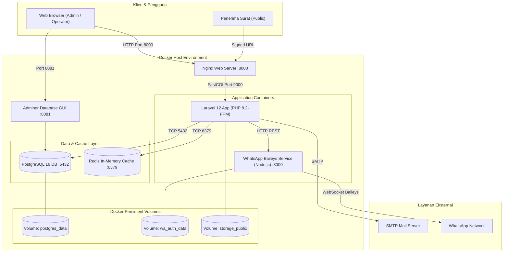
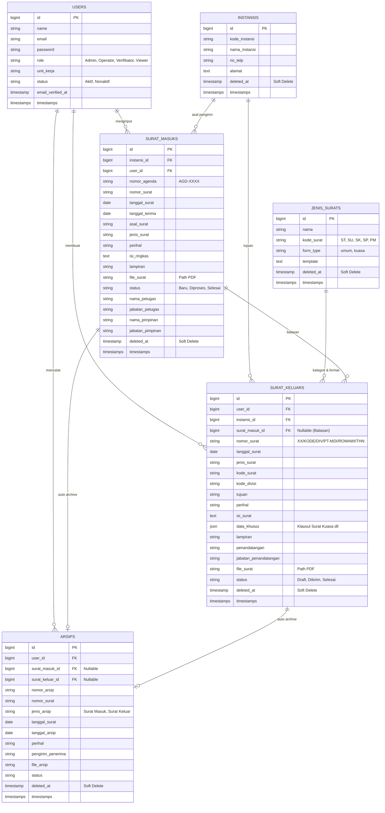
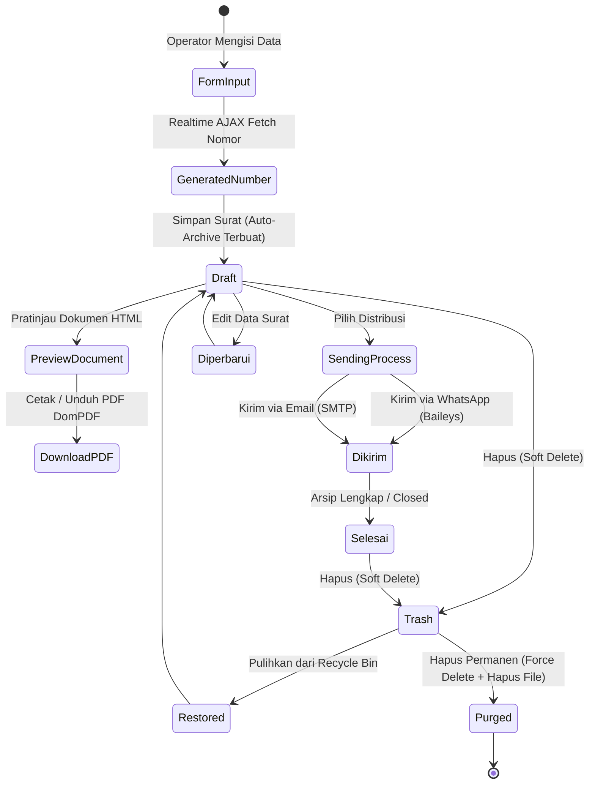

# Product Requirements Document (PRD)
## Sistem Informasi Manajemen Arsip & Penomoran Surat (SIMAS)
### PT Microdata Indonesia

---

## Informasi Dokumen

| Properti | Detail |
|---|---|
| **Nama Produk** | Sistem Informasi Manajemen Arsip & Penomoran Surat (SIMAS) |
| **Organisasi / Klien** | PT Microdata Indonesia |
| **Versi Dokumen** | 2.0.0 |
| **Status** | Approved / Active Development |
| **Tanggal Pembaruan** | 3 September 2026 |
| **Tim Pengembang** | Fahmi Mutaqin, Riyan Aditya, Zulfakar Anggara Dinata |
| **Tech Stack Utama** | Laravel 12 (PHP 8.2+), PostgreSQL 16, Docker Compose, Node.js WhatsApp Baileys, Tailwind CSS, Alpine.js, Redis |

---

## 1. Ringkasan Eksekutif & Visi Produk

### 1.1 Visi Produk
Mewujudkan tata kelola persuratan dan pengarsipan digital PT Microdata Indonesia yang terotomatisasi, akurat, aman, dan terintegrasi secara _real-time_ melalui automasi penomoran standar korporasi, pencatatan multi-entitas, pembangkitan dokumen PDF berbasis template dinamis, serta distribusi digital langsung melalui Email dan WhatsApp.

### 1.2 Ringkasan Solusi
Sistem Informasi Arsip Surat (SIMAS) mengintegrasikan siklus hidup tata kelola surat masuk dan keluar mulai dari penerimaan/pembuatan, penomoran terstandar berbasis format kode unit kerja dan angka Romawi, templating dokumen resmi (Surat Umum dan Surat Kuasa), pengarsipan otomatis (_instant auto-archive_), pencarian dan filtering multi-kriteria, pelaporan analitik bisnis, hingga fitur mitigasi kehilangan data berbasis Tempat Sampah (_Recycle Bin with Soft Deletes_). Seluruh ekosistem dikemas dalam arsitektur kontainerisasi Docker yang siap di-_deploy_ di lingkungan produksi.

---

## 2. Latar Belakang & Pernyataan Masalah

### 2.1 Masalah Saat Ini
1. **Human Error Penomoran Surat**: Penomoran surat manual kerap menimbulkan nomor ganda (_duplicate numbering_), salah format divisi, atau nomor terlewat (_skipped sequence_).
2. **Keterlambatan Distribusi**: Pengiriman surat resmi ke klien atau instansi mitra memerlukan cetak fisik atau langkah manual _attachment_ email yang tidak terpantau statusnya.
3. **Pencarian Dokumen yang Lambat**: Mengingat pertumbuhan volume arsip, pencarian fisik memakan waktu kerja signifikan bagi staf administrasi.
4. **Resiko Kehilangan Dokumen Fisik**: Kerusakan atau kehilangan fisik arsip tanpa cadangan digital terpusat.
5. **Ketiadaan Pelaporan Komprehensif**: Manajemen kesulitan memantau frekuensi, tren surat masuk/keluar, dan kepatuhan penyelesaian disposisi surat masuk.

### 2.2 Tujuan Bisnis
- **100% Automasi Penomoran Surat**: Menjamin tidak ada duplikasi nomor surat keluar dengan format standar perusahaan.
- **Efisiensi Waktu Distribusi Surat > 70%**: Pengiriman instan dokumen resmi via integrasi WhatsApp API (Baileys) dan Email SMTP berfitur _Signed URL_.
- **Sentralisasi Arsip 100% Digital**: Seluruh surat masuk dan keluar secara otomatis masuk ke repositori arsip terpadu.
- **Peningkatan Akuntabilitas & Audit Trail**: Pengelolaan data terisolasi berdasarkan riwayat pengguna, tanggal, dan mekanisme _Recycle Bin_ yang aman.

---

## 3. Pengguna Sasaran & Personas

```
┌─────────────────────────────────────────────────────────────┐
│                    STAKEHOLDERS & PERSONAS                  │
├─────────────────┬─────────────────┬─────────────────────────┤
│ Admin Sistem    │ Operator Surat  │ Verifikator / Pimpinan  │
│ (Full Control)  │ (Entry & Kirim) │ (Review & Monitoring)   │
└─────────────────┴─────────────────┴─────────────────────────┘
```

### 3.1 Persona Pengguna

#### 1. Admin Sistem
- **Karakteristik**: Tim IT / Kepala Bagian Administrasi.
- **Tanggung Jawab**: Manajemen user, konfigurasi sistem, kontrol penuh data master (Instansi, Jenis Surat), restore/force delete data di Tempat Sampah, pemeliharaan infrastruktur Docker & WhatsApp engine.
- **Kebutuhan Utama**: Akses kontrol penuh, audit log, konfigurasi server, backup database.

#### 2. Operator Administrasi / Sekretariat
- **Karakteristik**: Staf administrasi operasional harian.
- **Tanggung Jawab**: Menginput surat masuk, mencetak lembar agenda, membuat surat keluar dengan nomor otomatis, mendistribusikan surat via WhatsApp dan Email, mengekspor laporan.
- **Kebutuhan Utama**: Input form cepat, validasi otomatis, pratinjau live nomor surat dan template dokumen, tombol kirim digital sekali klik.

#### 3. Pimpinan / Verifikator / Viewer
- **Karakteristik**: Direktur, Manajer Unit Kerja, Pengawas Internal.
- **Tanggung Jawab**: Memantau dashboard statistik, membaca laporan bulanan, memeriksa disposisi atau status tindak lanjut surat.
- **Kebutuhan Utama**: Visualisasi dashboard yang intuitif, ekspor laporan PDF/Excel, filter periode yang fleksibel.

---

## 4. Ruang Lingkup Sistem (Scope of Work)

### 4.1 In Scope (Termasuk dalam Sistem)
- **Manajemen Pengguna**: Otentikasi berbasis session, register, login, profile management, password update.
- **Dashboard & Analitik**: Statistik agregat, komparasi tren 6 bulan (Chart.js), daftar data terkini.
- **Master Data Instansi**: Pengelolaan instansi mitra/pemerintah sebagai referensi asal/tujuan surat.
- **Master Data Jenis Surat Dinamis**: Manajemen kategori surat dengan pemilihan tipe formulir (`umum` atau `kuasa`) dan kode surat.
- **Modul Surat Masuk**: Pencatatan agenda otomatis (`AGD-XXXX`), upload PDF lampiran, export PDF lembar agenda, disposisi balasan.
- **Modul Surat Keluar**:
  - Penomoran surat otomatis format: `XX/KODE_SURAT/KODE_DIVISI/PT-MDI/BULAN_ROMAWI/TAHUN`.
  - Preview nomor surat realtime via AJAX.
  - Multi-template rendering: Template Surat Umum & Template Surat Kuasa (JSON `data_khusus`).
  - Generate PDF resmi DomPDF & Upload PDF kustom.
- **Distribusi Multi-Saluran**:
  - Pengiriman Email dengan attachment PDF via Laravel Mailable.
  - Pengiriman WhatsApp via WhatsApp Web API (Baileys REST Service) berlampiran dokumen.
  - URL Bertanda Tangan (_Signed URLs_) dengan batas kadaluarsa untuk unduhan aman pihak ketiga.
- **Arsip Surat Terpadu**: Sinkronisasi otomatis dari surat masuk dan keluar, pencarian multi-kolom, filter jenis/status, ekspor CSV.
- **Laporan & Rekapitulasi**: Filter periode tanggal & kategori, grafik harian, ekspor PDF, ekspor Excel (Maatwebsite), kirim laporan berkala via email.
- **Tempat Sampah (Recycle Bin)**: Dukungan Soft Deletes untuk 5 entitas utama (Surat Masuk, Surat Keluar, Arsip, Instansi, Jenis Surat) dengan aksi *Restore* dan *Force Delete* (pembersihan file storage permanen).
- **Infrastruktur Modern**: Docker Compose multi-kontainer (Nginx, PHP 8.2-FPM, PostgreSQL 16 Alpine, Redis, Node.js WhatsApp Server, Adminer GUI).

### 4.2 Out of Scope (Pengembangan Lanjutan)
- Optical Character Recognition (OCR) otomatis untuk membaca teks dari gambar pindaian fisik.
- Digital Signature berbasis Sertifikat Elektronik Balai Sertifikasi Elektronik (BSrE / X.509 PKI).
- Mobile Application Native (Android/iOS) — digantikan oleh Progressive/Responsive Web Interface.

---

## 5. Spesifikasi Kebutuhan Fungsional (Functional Requirements)

```
┌─────────────────────────────────────────────────────────────────────────┐
│                           MODUL UTAMA SISTEM                            │
├───────────────┬──────────────────────────┬──────────────────────────────┤
│ 1. Autentikasi│ 2. Dashboard Analitik    │ 3. Data Master (Instansi/JS) │
├───────────────┼──────────────────────────┼──────────────────────────────┤
│ 4. Surat Masuk│ 5. Surat Keluar (Auto No)│ 6. Distribusi (WA & Email)   │
├───────────────┼──────────────────────────┼──────────────────────────────┤
│ 7. Arsip Surat│ 8. Laporan & Ekspor      │ 9. Tempat Sampah (Recycle)   │
└───────────────┴──────────────────────────┴──────────────────────────────┘
```

### 5.1 Modul 1: Autentikasi & Akun Pengguna
| ID Kebutuhan | Deskripsi Fungsional | Input | Output / Perilaku |
|---|---|---|---|
| **FR-AUTH-01** | Pengguna dapat masuk ke sistem dengan email & password yang terdaftar | Email, Password, Remember Token | Sesi login aktif, redirect ke Dashboard |
| **FR-AUTH-02** | Pengguna baru dapat mendaftar akun ke sistem | Nama, Email, Password, Konfirmasi | Akun baru terbentuk, default role `Viewer` |
| **FR-AUTH-03** | Pengguna dapat mereset password via email saat lupa | Alamat Email | Tautan token reset berbatas waktu dikirim ke email |
| **FR-AUTH-04** | Pengguna dapat memperbarui nama, email, dan password lama pada menu Pengaturan Akun | Profil baru, Password Lama, Password Baru | Data profil diperbarui, password di-hash ulang (Bcrypt) |

### 5.2 Modul 2: Dashboard & Visualisasi Analitik
| ID Kebutuhan | Deskripsi Fungsional | Komponen Data |
|---|---|---|
| **FR-DASH-01** | Menampilkan kartu metrik total surat masuk, surat keluar, arsip, dan pengguna | Card widget dinamis |
| **FR-DASH-02** | Menampilkan visualisasi pie/donut breakdown status surat (Baru/Draft, Diproses/Dikirim, Selesai) | Chart.js visualisasi status |
| **FR-DASH-03** | Menampilkan grafik batang komparasi volume surat masuk vs keluar vs arsip selama 6 bulan terakhir | Bar Chart bulanan agregat |
| **FR-DASH-04** | Menampilkan tabel 5 surat masuk, surat keluar, dan arsip paling mutakhir | Table widget dengan link navigasi cepat |

### 5.3 Modul 3: Manajemen Data Master

#### 3.1 Data Master Instansi
- **FR-MST-INS-01**: CRUD Instansi (Kode Instansi, Nama Instansi, Nomor Telepon/WhatsApp, Alamat Lengkap).
- **FR-MST-INS-02**: Soft Delete Instansi yang tidak merusak relasi integritas surat masuk/keluar lampau (`withTrashed()`).

#### 3.2 Data Master Jenis Surat Dinamis
- **FR-MST-JS-01**: CRUD Jenis Surat dengan atribut `nama`, `kode_surat` (contoh: `ST`, `SU`, `SK`, `SP`, `PM`), dan `form_type` (`umum` / `kuasa`).
- **FR-MST-JS-02**: Pembuatan Jenis Surat baru dapat dilakukan secara _inline_ (modal AJAX) langsung dari form pembuatan Surat Keluar.

### 5.4 Modul 4: Manajemen Surat Masuk
| ID Kebutuhan | Deskripsi Fungsional | Aturan Bisnis |
|---|---|---|
| **FR-SM-01** | Registrasi surat masuk baru | Penomoran nomor agenda otomatis format `AGD-XXXX` urut per tahun |
| **FR-SM-02** | Relasi ke instansi pengirim | Memilih instansi terdaftar atau input referensi instansi |
| **FR-SM-03** | Upload berkas surat fisik | Validasi file PDF, kapasitas maksimal 2MB, simpan di `storage/app/public/surat_masuk/` |
| **FR-SM-04** | Unduh Lembar Agenda Surat Masuk | Generate PDF lembar disposisi agenda resmi PT Microdata Indonesia |
| **FR-SM-05** | Integrasi Pembuatan Balasan | Tombol aksi cepat untuk membuat surat keluar sebagai tindak lanjut/balasan |
| **FR-SM-06** | Pengarsipan Otomatis | Saat surat masuk disimpan, sistem otomatis membuat satu record di tabel `arsips` |

### 5.5 Modul 5: Manajemen Surat Keluar & Algoritma Penomoran Otomatis

#### 5.1 Algoritma Penomoran Surat Otomatis
Format standar penomoran surat PT Microdata Indonesia:
$$\text{Nomor Surat} = \text{URUT}/\text{KODE\_SURAT}/\text{DIVISI}/\text{PT-MDI}/\text{BULAN\_ROMAWI}/\text{TAHUN}$$
- **URUT**: Nomor urut increment (2 digit, e.g., `01`, `02`, `10`) berdasarkan jumlah surat keluar di bulan & tahun yang sama.
- **KODE_SURAT**: Diambil dari Data Master Jenis Surat (e.g., `ST` untuk Tugas, `SK` untuk Kuasa, `SP` untuk Pemberitahuan).
- **DIVISI**: Kode unit kerja penerbit (e.g., `DIR` Direksi, `DEV` Developer, `ADM` Administrasi, `MKT` Marketing).
- **PT-MDI**: Kode identitas tetap institusi PT Microdata Indonesia.
- **BULAN_ROMAWI**: Konversi otomatis bulan tanggal surat (`I`, `II`, `III`, ..., `XII`).
- **TAHUN**: 4 digit tahun penerbitan (e.g., `2026`).

#### 5.2 Formulir Dinamis Berbasis Template
- **Template Surat Umum**: Form standar dengan input Perihal, Lampiran, Isi Surat Bebas, Penandatangan, dan Jabatan.
- **Template Surat Kuasa**: Form dinamis (dikontrol Alpine.js) yang memunculkan input khusus:
  - Pihak Pertama (Pemberi Kuasa): Nama, NIK, Jabatan, Alamat.
  - Pihak Kedua (Penerima Kuasa): Nama, NIK, Jabatan, Alamat.
  - Klausul Wewenang/Peruntukan Kuasa.
  - Disimpan dalam struktur JSON `data_khusus` pada database.

#### 5.3 Pratinjau & Output Dokumen
- **FR-SK-01**: Pratinjau Realtime Nomor Surat saat user memilih jenis surat, divisi, dan tanggal surat tanpa reload halaman.
- **FR-SK-02**: Pratinjau Tampilan Surat HTML persis seperti layout cetak resmi kop surat perusahaan.
- **FR-SK-03**: Ekspor dokumen PDF standar korporasi menggunakan DomPDF.
- **FR-SK-04**: Opsi upload file PDF pindaian final bertanda tangan basah/cap basah.

### 5.6 Modul 6: Distribusi Digital (Email & WhatsApp Baileys Engine)

```
                       ┌─────────────────────────┐
                       │  Dokumen Surat Keluar   │
                       └────────────┬────────────┘
                                    │
            ┌───────────────────────┴───────────────────────┐
            ▼                                               ▼
┌───────────────────────────┐                   ┌───────────────────────────┐
│     Distribusi Email      │                   │    Distribusi WhatsApp    │
├───────────────────────────┤                   ├───────────────────────────┤
│ • SMTP Laravel Mailable   │                   │ • Node.js Express Baileys │
│ • Attach PDF / Signed URL │                   │ • Multi-device Session    │
│ • Status: Dikirim         │                   │ • Send Document + Caption │
└───────────────────────────┘                   └───────────────────────────┘
```

- **FR-DIST-01 (Email Delivery)**: Mengirim surat keluar ke alamat email tujuan dengan melampirkan file PDF dan tautan unduhan aman (_Signed URL_).
- **FR-DIST-02 (WhatsApp Integration Engine)**:
  - Mengirim dokumen via REST API ke service `wa-baileys-server` (`POST http://wa-server:3000/send-document`).
  - Mengirim teks kustom beserta dokumen PDF terlampir ke nomor WhatsApp instansi/penerima.
  - Mekanisme autentikasi QR code tersimpan persisten pada volume Docker `wa_auth_data`.
- **FR-DIST-03 (Signed URL Unduhan Publik)**: Tautan unduhan dokumen yang valid dan terenkripsi HMAC SHA-256 tanpa mewajibkan penerima login ke sistem.

### 5.7 Modul 7: Pengarsipan Otomatis & Pencarian
- **FR-ARS-01**: Seluruh data surat masuk dan keluar secara instan tercatat di tabel `arsips` tanpa langkah manual.
- **FR-ARS-02**: Pencarian cepat (_global search_) berdasarkan nomor surat, perihal, asal surat, tujuan, dan kategori.
- **FR-ARS-03**: Filter kombinatif berdasarkan jenis arsip (Surat Masuk / Surat Keluar) dan status dokumen.
- **FR-ARS-04**: Ekspor seluruh koleksi arsip hasil filter ke format CSV.

### 5.8 Modul 8: Pelaporan & Rekapitulasi
- **FR-LAP-01**: Pemfilteran laporan berdasarkan rentang tanggal (_start date_ & _end date_), jenis surat, dan status.
- **FR-LAP-02**: Visualisasi grafik garis (_Line Chart_) tren penerbitan dan penerimaan surat harian.
- **FR-LAP-03**: Ekspor laporan ke PDF dengan format tabel resmi berstempel dan bertanda tangan penanggung jawab.
- **FR-LAP-04**: Ekspor laporan ke format Microsoft Excel spreadsheet (`.xlsx`) via Maatwebsite Excel.
- **FR-LAP-05**: Pengiriman file laporan berkala langsung ke email pimpinan/stakeholder.

### 5.9 Modul 9: Tempat Sampah (Recycle Bin & Data Lifecycle)
- **FR-BIN-01**: Soft deletion diterapkan pada 5 entitas: `surat_masuks`, `surat_keluars`, `arsips`, `instansis`, dan `jenis_surats`.
- **FR-BIN-02 (Restore)**: Mengembalikan data yang terhapus ke tabel operasional utama beserta relasi terkait.
- **FR-BIN-03 (Force Delete)**: Menghapus permanen baris database dan menghapus file fisik di storage (`Storage::disk('public')->delete(...)`).

---

## 6. Kebutuhan Non-Fungsional (Non-Functional Requirements)

### 6.1 Keamanan (Security)
1. **Autentikasi & Autorisasi**:
   - Proteksi route berbasis middleware `auth`.
   - Pencegahan penghapusan akun mandiri (_self-deletion protection_).
2. **Perlindungan Injeksi & Serangan Web**:
   - CSRF Protection pada setiap form submission (`@csrf`).
   - Prepared statements / Eloquent ORM untuk mitigasi SQL Injection.
   - Enkripsi password menggunakan algoritma Bcrypt (12 cost factor).
3. **Integritas Unduhan**:
   - Akses dokumen publik menggunakan Laravel URL Signing (`signed` middleware).
4. **Validasi File**:
   - Validasi ketat MIME type berkas pindaian (`mimes:pdf`) dengan batasan ukuran file 2048 KB.

### 6.2 Performa & Skalabilitas
1. **Waktu Respon (Response Time)**:
   - Waktu render halaman rata-rata $\le 800\text{ ms}$ pada beban normal.
   - Live number generation via AJAX $\le 150\text{ ms}$.
2. **Caching & Queue**:
   - Redis 7.0 digunakan untuk penanganan cache query dan antrian background job email/notifikasi.
3. **Optimasi Aset Frontend**:
   - Vite bundling menghasilkan aset JavaScript & CSS yang ter-minifikasi.

### 6.3 Ketersediaan & Keandalan (Availability & Reliability)
1. **Containerized Environment**: Menjamin konsistensi lingkungan pengembangan dan produksi menggunakan Docker Compose.
2. **Volume Persisten**: Data PostgreSQL (`postgres_data`) dan sesi WhatsApp (`wa_auth_data`) tidak hilang saat container di-restart.
3. **Graceful Error Handling**: Validasi form menyajikan pesan error berbahasa Indonesia yang jelas bagi pengguna.

### 6.4 Usabilitas & Desain Antarmuka (UI/UX)
1. **Responsif**: Layout adaptif untuk desktop, tablet, dan smartphone dengan Tailwind CSS.
2. **Tipografi**: Menggunakan font modern *Plus Jakarta Sans*.
3. **Interaktivitas**: Komponen dinamis (modal, dynamic input, realtime counter) menggunakan Alpine.js tanpa beban _heavy framework_.

---

## 7. Arsitektur Sistem & Diagram

### 7.1 Arsitektur Kontainer Docker



### 7.2 Entity Relationship Diagram (ERD)



### 7.3 State Diagram Siklus Hidup Surat Keluar



---

## 8. Spesifikasi Kamus Data & Basis Data

### 8.1 Ringkasan Entitas & Aturan Integritas
1. **Konvensi Nama Tabel**: Plural (`surat_masuks`, `surat_keluars`, `arsips`, `instansis`, `jenis_surats`).
2. **Strategi Primary Key**: `bigIncrements('id')` atau `id()` (Big Integer Auto Increment).
3. **Foreign Keys**:
   - `surat_masuks.instansi_id` $\rightarrow$ `instansis.id` (`onDelete('set null')` atau `cascade`).
   - `surat_keluars.instansi_id` $\rightarrow$ `instansis.id` (`onDelete('set null')`).
   - `surat_keluars.user_id` $\rightarrow$ `users.id`.
   - `arsips.surat_masuk_id` $\rightarrow$ `surat_masuks.id`.
   - `arsips.surat_keluar_id` $\rightarrow$ `surat_keluars.id`.
4. **Soft Deletes**: Kolom `deleted_at (timestamp, nullable)` diterapkan pada seluruh entitas utama.

---

## 9. Spesifikasi Integrasi API (Microservice WhatsApp)

Sistem mengintegrasikan server Node.js terpisah berbasis library `@whiskeysockets/baileys` yang berjalan di port `3000`.

### 9.1 Endpoint Service WhatsApp

#### 1. Status Koneksi WhatsApp
- **Endpoint**: `GET http://wa-server:3000/status`
- **Response**:
  ```json
  {
    "status": "connected",
    "user": {
      "id": "6281234567890:1@s.whatsapp.net",
      "name": "Microdata Admin"
    }
  }
  ```

#### 2. Kirim Dokumen Surat & Caption
- **Endpoint**: `POST http://wa-server:3000/send-document`
- **Headers**: `Content-Type: application/json`
- **Request Body**:
  ```json
  {
    "phone": "081234567890",
    "documentUrl": "http://surat_penomoran_nginx:8000/storage/surat_keluar/dokumen_123.pdf",
    "fileName": "Surat_Tugas_01_ST_DIR_PT-MDI_IX_2026.pdf",
    "caption": "Yth. Pimpinan Instansi,\nBerikut terlampir Surat Resmi dari PT Microdata Indonesia."
  }
  ```
- **Response Sukses (200 OK)**:
  ```json
  {
    "success": true,
    "message": "Dokumen berhasil dikirim ke 6281234567890@s.whatsapp.net"
  }
  ```

---

## 10. Strategi Deployment & Lingkungan Docker

### 10.1 Konfigurasi Multi-Container (Docker Compose)
| Service Name | Image / Build | Port Host | Kegunaan |
|---|---|---|---|
| `web` | `nginx:alpine` | `8000:80` | Web server & reverse proxy FastCGI |
| `app` | Dockerfile (PHP 8.2-FPM) | *Internal* | Backend Laravel runtime & ekstensi lengkap |
| `db` | `postgres:16-alpine` | `5432:5432` | Database PostgreSQL |
| `redis` | `redis:7-alpine` | `6379:6379` | Cache & Job Queue |
| `wa-server` | Node.js 20 Alpine | `3000:3000` | Baileys WhatsApp Gateway |
| `adminer` | `adminer:latest` | `8081:8080` | Database Management Web UI |

### 10.2 Perintah Operasional
```bash
# Setup Otomatis (Windows)
.\docker-setup.bat

# Setup Otomatis (Linux / macOS)
chmod +x docker-setup.sh && ./docker-setup.sh

# Status Log WhatsApp untuk Scan QR Code
docker compose logs -f wa-server
```

---

## 11. Kriteria Penerimaan & Metrik Keberhasilan (Success Metrics)

| Parameter | Target Metrik | Metode Pengukuran |
|---|---|---|
| **Akurasi Penomoran Surat** | Duplikasi 0% ($100\%$ akurat) | Audit log database surat keluar |
| **Keberhasilan Distribusi WhatsApp** | $\ge 98\%$ pesan terkirim | Response callback server Baileys |
| **Kecepatan Pencarian Arsip** | $\le 1.0\text{ detik}$ | Pengujian query database pada 10.000 data |
| **Integritas Tempat Sampah** | 100% data terhapus dapat dipulihkan | Uji fungsi Restore & Relasi model |
| **Kelengkapan Dokumen PDF** | Format standar presisi (kop, margin, QR/Tanda Tangan) | Validasi visual hasil generate DomPDF |

---

## 12. Roadmap Pengembangan (Future Milestones)

```
┌────────────────────────────────────────────────────────────────────────┐
│                        ROADMAP PENGEMBANGAN                            │
├─────────────────────┬──────────────────────┬───────────────────────────┤
│ Fase 1 (Selesai)    │ Fase 2 (Aktif)       │ Fase 3 (Masa Depan)       │
├─────────────────────┼──────────────────────┼───────────────────────────┤
│ • Core CRUD Surat   │ • WhatsApp Baileys   │ • Tanda Tangan Digital    │
│ • Penomoran Otomatis│ • Template Kuasa     │   Tersertifikasi (BSrE)   │
│ • Docker Compose    │ • Signed URLs        │ • OCR Scanner Otomatis    │
│ • PostgreSQL 16     │ • Recycle Bin        │ • Mobile Apps Notifikasi  │
└─────────────────────┴──────────────────────┴───────────────────────────┘
```

1. **Fase 1 (Foundational - Completed)**:
   - Migrasi ke Laravel 12 & PostgreSQL 16.
   - Core CRUD Surat Masuk, Surat Keluar, Arsip, Instansi.
   - Penomoran otomatis dinamis dan generator PDF.
2. **Fase 2 (Integration & Robustness - Completed / Active)**:
   - Integrasi Docker Compose multi-kontainer dengan Redis dan Adminer.
   - Integrasi WhatsApp engine Baileys multi-device.
   - Template Surat Kuasa dinamis dengan struktur JSON `data_khusus`.
   - Implementasi Tempat Sampah (_Recycle Bin_) 5 entitas.
   - Signed URL untuk unduhan dokumen publik.
3. **Fase 3 (Advanced Capabilities - Roadmap)**:
   - Integrasi Sertifikat Elektronik & Tanda Tangan Digital Tersertifikasi (BSrE / e-Sign).
   - Fitur OCR untuk auto-fill metadata surat masuk dari berkas pindaian scan/foto.
   - Notifikasi push dan integrasi webhook bot Telegram/Discord.

---
*Dokumen ini merupakan acuan resmi pengembangan produk Sistem Informasi Manajemen Arsip & Penomoran Surat (SIMAS) PT Microdata Indonesia.*
