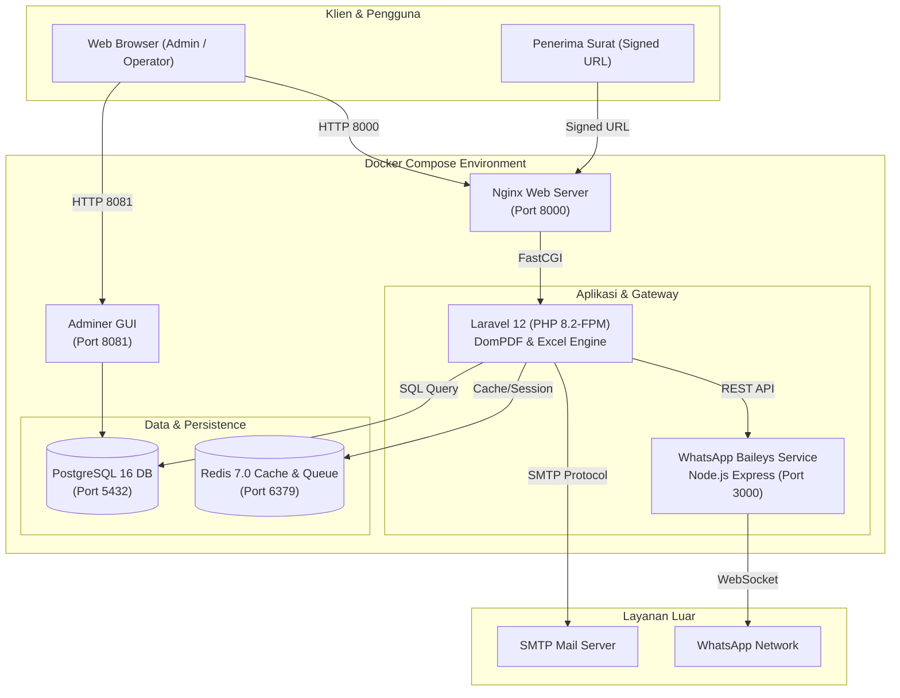
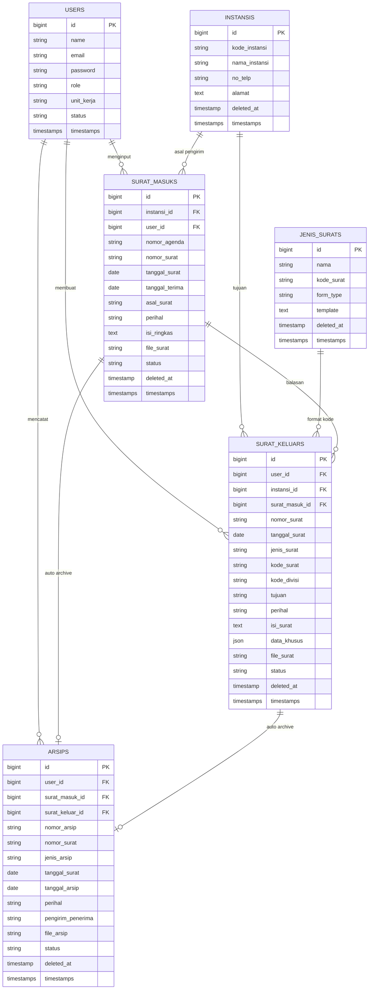

# Sistem Informasi Manajemen Arsip & Penomoran Surat (SIMAS)
### PT Microdata Indonesia


Sistem informasi berbasis web modern untuk pengelolaan administrasi persuratan dan pengarsipan digital di **PT Microdata Indonesia**. Dilengkapi dengan automasi penomoran surat berstandar korporasi, dukungan multi-template dinamis (Surat Umum & Surat Kuasa), pembangkitan dokumen PDF, distribusi digital via Email & WhatsApp (Baileys), pelaporan analitik, dan perlindungan data dengan Tempat Sampah (*Recycle Bin*).

---

## 📑 Daftar Isi

- [Tentang Project](#tentang-project)
- [Tujuan & Manfaat](#tujuan--manfaat)
- [Fitur Utama](#fitur-utama)
- [Arsitektur Sistem](#arsitektur-sistem)
- [Entity Relationship Diagram (ERD)](#entity-relationship-diagram-erd)
- [Teknologi yang Digunakan](#teknologi-yang-digunakan)
- [Struktur Direktori Project](#struktur-direktori-project)
- [Instalasi & Menjalankan Project](#instalasi--menjalankan-project)
  - [Opsi 1: Menjalankan dengan Docker (Direkomendasikan)](#opsi-1-menjalankan-dengan-docker-direkomendasikan)
  - [Opsi 2: Menjalankan Secara Lokal (Manual)](#opsi-2-menjalankan-secara-lokal-manual)
- [Menghubungkan WhatsApp Gateway (Baileys)](#menghubungkan-whatsapp-gateway-baileys)
- [Konfigurasi Environment (.env)](#konfigurasi-environment-env)
- [Akun Demo & Role Akses](#akun-demo--role-akses)
- [Alur Kerja Sistem (Workflow)](#alur-kerja-sistem-workflow)
- [Pengujian (Testing)](#pengujian-testing)
- [Dokumentasi Terkait](#dokumentasi-terkait)
- [Tim Pengembang](#tim-pengembang)
- [Lisensi](#lisensi)

---

## 🏢 Tentang Project

**Sistem Informasi Manajemen Arsip & Penomoran Surat PT Microdata Indonesia** dirancang untuk mengeliminasi kelemahan tata kelola arsip konvensional seperti duplikasi nomor surat, pencarian dokumen yang lambat, resiko dokumen fisik hilang/rusak, dan lambatnya distribusi dokumen ke pihak eksternal.

Aplikasi ini menyatukan proses administrasi surat masuk dan keluar dalam satu platform terintegrasi dengan automasi nomor surat instan, pembangkitan dokumen PDF resmi siap cetak, pengarsipan otomatis tanpa input ganda, pelaporan statistik interaktif, serta integrasi gateway WhatsApp dan Email.

---

## 🎯 Tujuan & Manfaat

1. **Automasi Penomoran Surat**: Penomoran surat keluar dibuat otomatis sesuai format baku (`URUT/KODE_SURAT/DIVISI/PT-MDI/BULAN_ROMAWI/TAHUN`) tanpa resiko nomor ganda.
2. **Pengarsipan Terpusat & Otomatis**: Setiap surat masuk dan keluar secara instan tercatat pada repositori arsip digital.
3. **Multi-Template Dinamis**: Mendukung berbagai format surat resmi seperti Surat Tugas, Undangan, Pemberitahuan, hingga Surat Kuasa dengan isian klausul khusus.
4. **Distribusi Dokumen Instan**: Pengiriman surat ke instansi tujuan melalui integrasi WhatsApp Web API (Baileys) dan Email SMTP dengan lampiran PDF serta *Signed URLs*.
5. **Mitigasi Kehilangan Data**: Fitur *Recycle Bin* (Soft Deletes) memungkinkan pemulihan (*restore*) atau penghapusan permanen (*force delete*) data dan file berkas.
6. **Laporan & Analitik Bisnis**: Rekapitulasi data statistik surat dengan grafik tren, ekspor PDF, ekspor Excel, dan pengiriman rekap via email.

---

## ⚡ Fitur Utama

### 🔐 1. Autentikasi & Pengaturan Akun
- Login, Logout, dan Registrasi akun baru (Laravel Breeze).
- Lupa password & reset password via email bertoken.
- Edit profil akun (Nama, Email) dan pembaruan password dengan verifikasi password lama.
- Proteksi keamanan: *Self-deletion prevention*, CSRF protection, dan password hashing Bcrypt.

### 📊 2. Dashboard Interaktif
- Kartu statistik total surat masuk, surat keluar, arsip, dan pengguna.
- Visualisasi status surat (Baru/Draft, Diproses/Dikirim, Selesai).
- Grafik komparasi surat 6 bulan terakhir menggunakan Chart.js.
- Tabel pintasan 5 surat masuk, surat keluar, dan arsip terbaru.

### 📥 3. Modul Surat Masuk
- Pencatatan surat masuk dengan nomor agenda otomatis (`AGD-XXXX`).
- Relasi terpadu dengan Data Master Instansi pengirim.
- Upload berkas pindaian surat (PDF max 2MB).
- Cetak / Download Lembar Agenda Disposisi Resmi ke PDF.
- Tombol integrasi langsung untuk membuat Surat Keluar balasan.
- Pengarsipan otomatis (*auto-archive*) saat data surat masuk disimpan.

### 📤 4. Modul Surat Keluar & Template Dinamis
- **Penomoran Otomatis**: Format `XX/KODE/DIVISI/PT-MDI/BULAN_ROMAWI/TAHUN`.
- **Live Realtime Preview**: Pratinjau nomor surat secara langsung saat mengubah tanggal, divisi, atau jenis surat.
- **Formulir Dinamis (Alpine.js)**:
  - **Surat Umum**: Perihal, Lampiran, Isi Surat Bebas, Penandatangan & Jabatan.
  - **Surat Kuasa**: Input khusus Pemberi Kuasa, Penerima Kuasa, dan Klausul Wewenang (disimpan dalam format JSON `data_khusus`).
- **Pratinjau HTML & Ekspor PDF**: Generate dokumen resmi siap cetak lengkap dengan Kop Surat PT Microdata Indonesia.
- **Upload Berkas Scan**: Opsi unggah berkas PDF final bertanda tangan/stempel basah.

### 🚀 5. Distribusi Digital (WhatsApp & Email)
- **WhatsApp Gateway (Baileys)**: Kirim dokumen surat beserta pesan kustom langsung ke nomor WhatsApp instansi tujuan via REST API Node.js.
- **Email Delivery**: Kirim surat keluar langsung ke email instansi lengkap dengan lampiran PDF.
- **Signed Public URLs**: Tautan unduhan dokumen publik terenkripsi berbatas waktu untuk pihak penerima tanpa harus login.

### 🗄️ 6. Modul Arsip Terpadu
- Sinkronisasi otomatis dari setiap transaksi surat masuk dan keluar.
- Fitur pencarian multi-kolom (Nomor Surat, Perihal, Asal/Tujuan).
- Filter interaktif berdasarkan Jenis Arsip dan Status.
- Ekspor seluruh daftar arsip ke format CSV.

### 🏢 7. Data Master
- **Master Instansi**: Kelola kode, nama, nomor kontak, dan alamat instansi mitra/pemerintah.
- **Master Jenis Surat**: Kelola nama, kode surat (`ST`, `SU`, `SK`, `SP`, `PM`), dan tipe formulir (`umum` / `kuasa`). Dapat ditambahkan langsung melalui modal di form surat keluar.

### 📈 8. Laporan & Rekapitulasi
- Filter rekapitulasi berdasarkan rentang tanggal (*start date* - *end date*), jenis surat, dan status.
- Grafik tren harian surat (*Line Chart*).
- Ekspor laporan ke dokumen PDF resmi berstempel dan bertanda tangan.
- Ekspor laporan ke spreadsheet Microsoft Excel (`.xlsx`) via Maatwebsite Excel.
- Pengiriman file laporan langsung ke email pimpinan/stakeholder.

### ♻️ 9. Tempat Sampah (Recycle Bin & Data Lifecycle)
- Diterapkan pada 5 entitas: Surat Masuk, Surat Keluar, Arsip, Instansi, dan Jenis Surat.
- **Restore**: Mengembalikan data dan mempertahankan integritas relasi.
- **Force Delete**: Menghapus permanen baris database sekaligus membersihkan berkas fisik dari storage.

---

## 🏗️ Arsitektur Sistem



---

## 📊 Entity Relationship Diagram (ERD)



---

## 🛠️ Teknologi yang Digunakan

| Komponen | Teknologi | Keterangan |
|---|---|---|
| **Backend Framework** | **Laravel 12** | PHP 8.2+ MVC Web Framework |
| **Database** | **PostgreSQL 16 Alpine** | Database relasional utama |
| **Containerization** | **Docker & Docker Compose** | Multi-container orchestration |
| **Web Server** | **Nginx Alpine** | Reverse proxy dan HTTP server |
| **In-Memory Cache** | **Redis 7.0** | Cache & Queue session management |
| **WhatsApp Gateway** | **Node.js + Baileys** | `@whiskeysockets/baileys` multi-device engine |
| **Database GUI** | **Adminer** | Manajemen web UI database PostgreSQL |
| **Frontend Styling** | **Tailwind CSS 3** | Utility-first CSS framework |
| **Frontend Scripting** | **Alpine.js 3** | Interaktivitas UI ringan & reaktif |
| **Tabel Interaktif** | **DataTables (jQuery)** | Pencarian, sorting, dan pagination tabel |
| **PDF Generation** | **DomPDF (barryvdh/laravel-dompdf)** | Render dokumen PDF resmi dari Blade |
| **Excel Export** | **Maatwebsite Excel** | Export data spreadsheet `.xlsx` |
| **Visual Chart** | **Chart.js** | Visualisasi statistik pada dashboard & laporan |
| **Asset Bundler** | **Vite** | Modern frontend build tool |
| **Testing** | **Pest PHP** | Automated test framework |

---

## 📁 Struktur Direktori Project

```
surat-penomoran/
├── app/
│   ├── Exports/              # Export class (LaporanExport)
│   ├── Http/
│   │   └── Controllers/      # Controller logika bisnis
│   │       ├── Auth/          # Breeze Authentication Controllers
│   │       ├── AccountController.php
│   │       ├── ArsipController.php
│   │       ├── DashboardController.php
│   │       ├── InstansiController.php
│   │       ├── JenisSuratController.php
│   │       ├── LaporanController.php
│   │       ├── RecycleBinController.php
│   │       ├── SuratKeluarController.php
│   │       ├── SuratMasukController.php
│   │       └── UserController.php
│   ├── Mail/                 # Mailable class (LaporanMail, SuratKeluarMail)
│   └── Models/               # Eloquent Models (SuratMasuk, SuratKeluar, Arsip, dll.)
├── database/
│   ├── migrations/           # Skema migration database PostgreSQL
│   └── seeders/              # Seeder data awal (User, Jenis Surat, dll.)
├── docker/                   # Konfigurasi Nginx dan PHP-FPM Docker
├── resources/
│   └── views/                # Blade Templates
│       ├── akun/             # Pengaturan profil & password
│       ├── arsip/            # Tampilan arsip surat
│       ├── auth/             # Form login, register, reset password
│       ├── instansi/         # CRUD Data Instansi
│       ├── jenis_surat/      # CRUD Data Jenis Surat
│       ├── laporan/          # Halaman laporan & preview PDF/Excel
│       ├── layouts/          # Layout template (app, sidebar, navbar)
│       ├── recyclebin/       # Tempat Sampah
│       ├── surat_keluar/     # Form input, preview, template kuasa & umum
│       └── surat_masuk/      # Form input, disposisi, lembar agenda
├── routes/
│   ├── auth.php              # Route autentikasi
│   └── web.php               # Route utama aplikasi
├── wa-baileys-server/        # Microservice WhatsApp Gateway (Node.js)
│   ├── index.js              # Server Express + Baileys
│   └── package.json
├── docker-compose.yml        # Orchestration 6 container services
├── docker-setup.bat          # Helper script otomatis (Windows)
├── docker-setup.sh           # Helper script otomatis (Linux / macOS)
├── DOCKER_GUIDE.md           # Panduan lengkap Docker & Troubleshooting
├── PRD.md                    # Product Requirements Document
└── README.md                 # Dokumentasi utama project
```

---

## 🚀 Instalasi & Menjalankan Project

### Opsi 1: Menjalankan dengan Docker (Direkomendasikan)

Pastikan **Docker Desktop** sudah terinstall dan sedang berjalan di komputer Anda.

#### 1. Setup Cepat (One-Click Script)
- **Windows**: Jalankan script berikut di Command Prompt / PowerShell:
  ```cmd
  .\docker-setup.bat
  ```
- **Linux / macOS / WSL**:
  ```bash
  chmod +x docker-setup.sh
  ./docker-setup.sh
  ```

#### 2. Setup Manual Docker
```bash
# 1. Salin konfigurasi environment docker
cp .env.docker.example .env

# 2. Build dan jalankan seluruh container di background
docker compose up -d --build

# 3. Generate Application Key
docker compose exec app php artisan key:generate

# 4. Buat Storage Link
docker compose exec app php artisan storage:link

# 5. Jalankan Migration dan Seeder
docker compose exec app php artisan migrate --seed
```

Aplikasi siap diakses melalui browser:
- **Aplikasi Web**: [http://localhost:8000](http://localhost:8000)
- **Adminer Database GUI**: [http://localhost:8081](http://localhost:8081) *(Server: `db`, User: `postgres`, Pass: `secret`, DB: `surat_penomoran`)*
- **WhatsApp Service API**: [http://localhost:3000](http://localhost:3000)

---

### Opsi 2: Menjalankan Secara Lokal (Manual)

#### Prasyarat:
- PHP >= 8.2 (dengan ekstensi `pdo_pgsql`, `pgsql`, `gd`, `zip`)
- Composer 2.x
- Node.js >= 18.x & NPM
- PostgreSQL 16+

```bash
# 1. Masuk ke direktori project
cd surat-penomoran

# 2. Install dependensi PHP & JS
composer install
npm install

# 3. Salin file .env dan sesuaikan database PostgreSQL Anda
cp .env.example .env

# 4. Generate App Key
php artisan key:generate

# 5. Jalankan Migration & Seeder
php artisan migrate --seed

# 6. Buat Storage Link
php artisan storage:link

# 7. Build asset frontend
npm run build

# 8. Jalankan development server
php artisan serve
```

---

## 📱 Menghubungkan WhatsApp Gateway (Baileys)

Untuk mengaktifkan fitur pengiriman surat via WhatsApp:

1. Pantau log container WhatsApp:
   ```bash
   docker compose logs -f wa-server
   ```
2. QR Code akan tampil di terminal.
3. Buka WhatsApp di ponsel Anda: **Perangkat Tertaut (Linked Devices) > Tautkan Perangkat (Link a Device)**.
4. Scan QR Code tersebut.
5. Sesi WhatsApp akan tersimpan persisten di volume `wa_auth_data` sehingga **tidak perlu scan ulang** saat restart container.

---

## ⚙️ Konfigurasi Environment (.env)

Pastikan konfigurasi kunci berikut disesuaikan:

```env
APP_NAME="Sistem Arsip Surat"
APP_ENV=local
APP_DEBUG=true
APP_URL=http://localhost:8000

# Database PostgreSQL
DB_CONNECTION=pgsql
DB_HOST=db             # Gunakan 127.0.0.1 jika menjalankan tanpa Docker
DB_PORT=5432
DB_DATABASE=surat_penomoran
DB_USERNAME=postgres
DB_PASSWORD=secret

# Redis Cache & Session
REDIS_HOST=redis       # Gunakan 127.0.0.1 jika menjalankan tanpa Docker
REDIS_PORT=6379

# WhatsApp Baileys Service
WA_SERVER_URL=http://wa-server:3000

# Email (SMTP)
MAIL_MAILER=smtp
MAIL_HOST=smtp.mailtrap.io
MAIL_PORT=2525
MAIL_USERNAME=null
MAIL_PASSWORD=null
MAIL_ENCRYPTION=tls
MAIL_FROM_ADDRESS="no-reply@microdata.id"
MAIL_FROM_NAME="${APP_NAME}"
```

---

## 👤 Akun Demo & Role Akses

Setelah menjalankan `php artisan db:seed`, akun demo default dapat digunakan untuk login:

| Field | Kredensial |
|---|---|
| **Email** | `test@example.com` |
| **Password** | `password` |

### Role Akses Sistem:
| Role | Deskripsi Hak Akses |
|---|---|
| **Admin** | Akses penuh ke seluruh menu, manajemen pengguna, data master, dan pembersihan tempat sampah |
| **Operator** | Mengelola surat masuk, membuat surat keluar, mengirim dokumen via WA/Email, dan mengunduh laporan |
| **Verifikator** | Memeriksa dan memvalidasi keabsahan data surat |
| **Viewer** | Membaca data surat dan laporan (role bawaan registrasi baru) |

---

## 🔄 Alur Kerja Sistem (Workflow)

```
                     ┌──────────────────┐
                     │   Landing Page   │
                     └────────┬─────────┘
                              │
                              ▼
                     ┌──────────────────┐
                     │   Login Sistem   │
                     └────────┬─────────┘
                              │
                              ▼
                     ┌──────────────────┐
                     │    Dashboard     │
                     └────────┬─────────┘
                              │
       ┌──────────────────────┼──────────────────────┐
       ▼                      ▼                      ▼
┌──────────────┐      ┌──────────────┐      ┌──────────────────┐
│  Data Master │      │ Surat Masuk  │      │   Surat Keluar   │
│ • Instansi   │      │ • Agenda Auto│      │ • Auto No Format │
│ • Jenis Surat│      │ • Upload PDF │      │ • Multi-Template │
└──────────────┘      │ • Balasan    │      │ • Kirim WA/Email │
                      └───────┬──────┘      └────────┬─────────┘
                              │                      │
                              └──────────┬───────────┘
                                         ▼
                             ┌────────────────────────┐
                             │    Pengarsipan Auto    │
                             │ • Filter, Search & CSV │
                             └───────────┬────────────┘
                                         │
       ┌─────────────────────────────────┴─────────────────────────────────┐
       ▼                                                                   ▼
┌──────────────┐                                                   ┌──────────────┐
│   Laporan    │                                                   │ Tempat Sampah│
│ • PDF/Excel  │                                                   │ • Restore    │
│ • Kirim Email│                                                   │ • Force Purge│
└──────────────┘                                                   └──────────────┘
```

---

## 🧪 Pengujian (Testing)

Project ini dilengkapi dengan test otomatis berbasis **Pest PHP**:

```bash
# Menjalankan seluruh test (Lokal)
php artisan test

# Menjalankan test di dalam container Docker
docker compose exec app php artisan test
```

---

## 📚 Dokumentasi Terkait

Untuk panduan teknis yang lebih mendalam, silakan baca dokumentasi pendukung berikut:
- 📄 [PRD.md](file:///d:/project/surat-penomoran/PRD.md) - *Product Requirements Document* resmi sistem
- 🐳 [DOCKER_GUIDE.md](file:///d:/project/surat-penomoran/DOCKER_GUIDE.md) - Panduan lengkap Docker, port, dan solusi troubleshooting

---

## 👥 Tim Pengembang

Project ini dikembangkan oleh:
- **Fahmi Mutaqin**
- **Riyan Aditya**
- **Zulfakar Anggara Dinata**

---

## 📄 Lisensi

Hak Cipta © 2026 PT Microdata Indonesia. Seluruh hak cipta dilindungi undang-undang.
